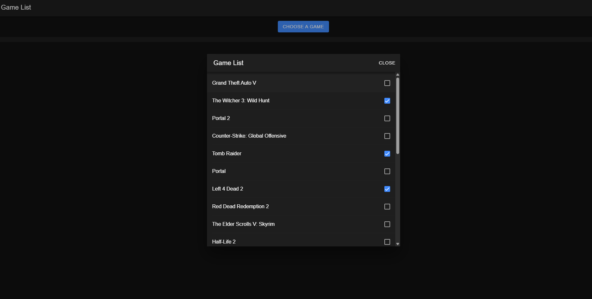
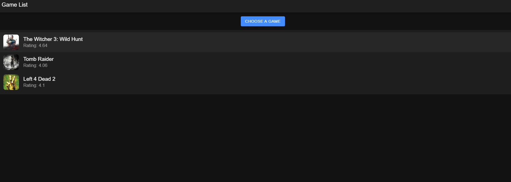
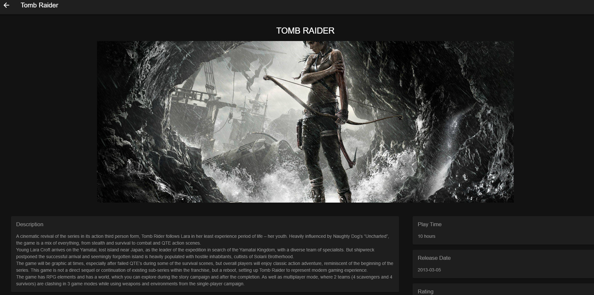

# 🎮 Game List

Webová aplikace napsaná v **Angularu**, která přes **RAWG API** stahuje katalog her a umožňuje uživateli vybrat si oblíbené tituly na přehlednou hlavní obrazovku, kde si u každé hry může zobrazit podrobné informace.

## ✨ Funkce

- **Výběr her ze seznamu** — modální okno se scrollovatelným seznamem her a zaškrtávacími políčky
- **Přizpůsobitelná hlavní obrazovka** — vybrané hry se zobrazí jako dlaždice s obrázkem a hodnocením
- **Detail hry** — obrázek, popis, doba hraní (Play Time), datum vydání (Release Date), hodnocení (Rating), platformy a systémové požadavky (PC Requirements)
- **Data z veřejného API** — hry, hodnocení a popisy stahovány dynamicky přes RAWG API

## 🖥️ Ukázka aplikace

**Výběr her ze seznamu**


**Hlavní obrazovka s vybranými hrami**


**Detail hry**


## 🛠️ Použité technologie

| Technologie | Účel |
|---|---|
| Angular / TypeScript | frontend framework a hlavní jazyk aplikace |
| RxJS | práce s asynchronními daty (HTTP volání) |
| RAWG API | zdroj dat o hrách — hodnocení, popisy, platformy, obrázky |

## 🚀 Spuštění projektu

### Požadavky
- Node.js a npm
- Angular CLI
- Vlastní API klíč z [rawg.io](https://rawg.io/apidocs)

### Postup
1. Naklonujte repozitář:
   ```bash
   git clone <ODKAZ_NA_REPO>
   ```
2. Nainstalujte závislosti:
   ```bash
   npm install
   ```
3. Do `src/services/games/games.service.ts` doplňte vlastní RAWG API klíč do proměnné `apiKey` (klíč není součástí repozitáře z bezpečnostních důvodů).
4. Spusťte vývojový server:
   ```bash
   ng serve
   ```
5. Otevřete `http://localhost:4200` v prohlížeči.

## 👤 Autor

**Lukáš Černoch**
[GitHub](https://github.com/Lukas-Cernoch)
